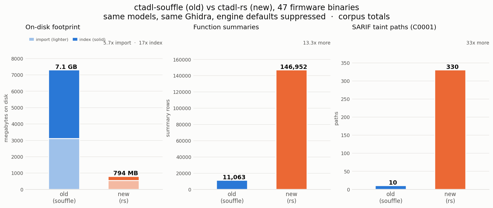
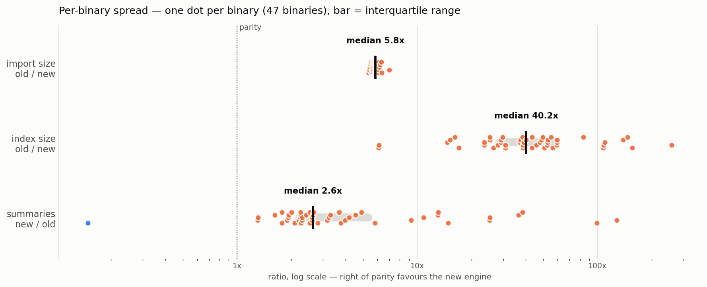

# Head to head: ctadl-souffle vs ctadl-rs on firmware — DO-NOT-MERGE

**Date:** 2026-08-13 · **Old:** `ctadl-souffle` 0.14.1 (Python + Souffle 2.3, `../ctadl`) ·
**New:** `ctadl-rs` 0.1.2 (this repo, branch `head-to-head-vs-ctadl-souffle-firmware`)
**Corpus:** 50 binaries from `operation-mango-public/firmware/7_firmware`
**Everything lives in** `firmware-eval/run/head2head/`; raw data in `firmware-eval/run/head2head/results/`.

*Supersedes the earlier 5-binary run, kept at `firmware-eval/run/head2head/results-5binary/`.*

---

## TL;DR

On 50 firmware binaries, with the **same models**, the **same Ghidra**, and each
engine's own defaults suppressed — 47 of which both engines finished:

| | old (souffle) | new (rs) | old / new |
|---|--:|--:|--:|
| import size, total | 3.0 GB | 544 MB | **5.7×** |
| index size, total | 4.1 GB | 250 MB | **16.8×** |
| function summaries, total | 11,063 | 146,952 | 0.08× |
| SARIF taint paths, total | **10** | **330** | 0.03× |
| binaries with ≥1 path | 5 of 47 | 17 of 47 | |
| binaries the engine could not finish | **3 of 50** | 0 of 50 | |



Three claims, in decreasing order of how much I would stake on them:

1. **The new engine's index is smaller, on every binary.** Median 40× smaller,
   and the *worst* case in the corpus is still 6× smaller. Nothing about this
   depends on the taint models being right.
2. **The old engine crashes on binaries the new one handles.** Three of 50, all
   the same internal error. This did not appear at n=5.
3. **The new engine reports many more paths, and the old engine's findings are
   a strict subset of the new engine's.** Zero old-only endpoint pairs across
   all 47 comparable binaries. The path counts themselves are unverified, so
   this is a recall-shaped result, not a precision-shaped one.

---

## What was held equal

The comparison is only worth something if the two engines differ in *engine* and
nothing else.

**1. One Ghidra — and this was wrong in the 5-binary run.** Both engines lift the
binary themselves, so a Ghidra skew shows up as an analysis difference that is
really a frontend difference. The earlier write-up said `nix develop .#head2head`
"exports `GHIDRA_HOME`, which is how both frontends locate it." Only half of that
is true. **ctadl-souffle's Nix wrapper hard-`export`s its own `GHIDRA_HOME` and
overrides whatever the shell set.** So the 5-binary run actually had ctadl-rs on
`ghidra-bin` (the upstream `PUBLIC` release) and ctadl-souffle on `ghidra` (the
`NIX` build from source) — same version 12.0.4, different derivation.

The devShell now reads the Ghidra path *out of souffle's own wrapper* and hands
ctadl-rs that one, and aborts if it cannot find it. Verified by watching the
process table during both engines' import phases: one store path,
`w9g7nhx…-ghidra-12.0.4`, for both.

**2. One model set, with both engines' defaults off.** Unchanged from the
5-binary run, and `models/build_models.py` regenerates all four files
byte-identically. One shared set in each engine's syntax:

- **49 propagation (library) generators** — the union of ctadl-rs's
  `native-index.jsonl`, ctadl-souffle's `pcode/default-index.json`, and the
  string-builder models in `firmware-eval/models/cmdi-firmware.json5`.
- **12 endpoint generators** — the command-injection sources and sinks from
  `cmdi-firmware.json5` (Operation Mango's source/sink set).

Union rather than intersection for a mechanical reason: ctadl-souffle has no
`--no-default-models`, so `index --models F` *adds* F to its built-in defaults.
Its defaults are unavoidable, so the only set both engines can end up with is one
that contains them. ctadl-rs is then run with `--no-default-models`.

**3. Same phases, same measurements, same machine, one job at a time.** import →
index → query for both, each phase guarded by a wall timeout and a physical-
footprint cap, index size measured after index and *before* query (ctadl-souffle
writes query results back into `ctadlir.db`, which would otherwise inflate it).

**4. A zero that means the same thing in both engines.** ctadl-rs exits *nonzero*
when no configured sink matches the program; ctadl-souffle exits 0 and reports no
paths. Left alone, a binary where both engines legitimately find nothing would be
scored `0 paths` for the old engine and `crash` for the new one — and dropping
the binary would have been exactly the wrong correction. `run_one.py` now
normalizes both to a valid zero-path measurement and flags it; 2 binaries are
flagged, and the flag is reported in `TABLE.md`.

### What could not be held equal — the model translation

The two engines spell access paths differently, so the shared set is a faithful
translation, not the same bytes:

| ctadl-rs | ctadl-souffle | why |
|---|---|---|
| `.deref` | `.*` | each engine's spelling for "the bytes at this pointer"; `.*` is what souffle's pcode frontend actually emits for a dereference |
| source `saturating: true` | `all_fields: true` | "all of this is attacker-controlled, however the callee indexes in" |
| sink `wildcard` (default) | dropped, or `all_fields: true` on a sink whose port carries no field | rs matches every extension of the port; souffle's nearest equivalent |

`where` clauses need no translation: `signature_match` + `names` and `name` +
`pattern` (a regex) match the function's short name identically in both.

---

## The corpus

50 binaries, picked by `select_corpus.py` so that "why these 50?" has a program
as its answer rather than a taste. Four filters and one sample, all applied blind
to either engine's output and before either was run:

1. ELF **executables** under the 7 device roots of the SaTC corpus behind
   Operation Mango's paper. Shared objects dropped — the experiment analyzes
   programs, and a library has no `main`.
2. **Deduplicated by content hash**, then one per name per device. The same
   busybox ships under a dozen names; analyzing it a dozen times would weight the
   corpus by packaging accident. (This is also why Tenda AC15 and AC18, which are
   the same firmware line, contribute 6 and 2: their shared binaries are
   *literally identical bytes* and collapse into one.)
3. **Size in [8 K, 512 K].** The floor drops stubs. **The ceiling is set by
   ctadl-souffle, not by ctadl-rs** — Souffle indexes the whole program eagerly,
   and the megabyte-class `httpd`/`fbwifi` binaries are out of its reach in any
   reasonable budget. Both engines get the same ceiling, so the ceiling favours
   the old engine.
4. **Must contain at least one command-execution sink symbol AND at least one
   taint source symbol** from the shared query models. A binary with no
   `system`-like callee cannot have a command-injection path in *either* engine,
   so including it would measure nothing but Ghidra.

296 binaries survive; the 50 are then a per-device size-stratified sample
preferring the web/CGI/config-daemon attack surface (equal-count size bins, best
attack-surface tier in each). The 5 binaries of the earlier run are pinned in, so
these numbers are a superset of the ones already reported.

| | |
|---|---|
| devices | 7 — R7000 12, R6400v2 9, XR300 9, DIR-878 7, AC15 6, W20E 5, AC18 2 |
| vendors | Netgear 30, Tenda 13, D-Link 7 |
| architecture | ARM 43, MIPS 7 |
| size | 9 K – 419 K |

**The one place the corpus is thin is architecture.** 7 of 50 are MIPS because
only one of the seven devices is a MIPS device. That is a property of this
corpus, not a choice, and it is the caveat I would put first.

---

## Results

Full per-binary table: `firmware-eval/run/head2head/results/TABLE.md`. Every
number, plus a record per path, is in `results/aggregate.json`.

### Size — the most solid result

The old engine's import is **5.4–7.0×** larger, and its index is larger on
**every one of the 47** binaries. Totals can be carried by one big binary, so the
same comparison computed per binary and quantiled:

| ratio | min | q1 | **median** | q3 | max |
|---|--:|--:|--:|--:|--:|
| import size, old / new | 5.37× | 5.66× | **5.85×** | 6.05× | 6.98× |
| index size, old / new | 6.11× | 28.55× | **40.24×** | 55.81× | 258.32× |
| summaries, new / old | 0.15× | 2.22× | **2.64×** | 5.36× | 128.18× |



Import is a tight band — Souffle reads text `.facts` files where the new engine
writes a binary IR, and that ratio is close to a constant. The index gap is wide
and *varies*, from 6× to 258×: the old engine's index is a SQLite database
holding the full materialized relation set, the new engine's is a directory of
Parquet files, and how much that saves depends on the program.

### Summaries

The new engine derives more compositional summaries on **46 of 47** binaries,
median 2.6×. Summaries are what carry taint across a call, so this is the
mechanism behind the path counts.

**The exception is worth naming: `r7000_circled`, where the old engine derives
3,199 summaries to the new engine's 476** — the single blue dot on the spread
chart. The new engine still reports 23 paths there to the old engine's 0, so more
summaries did not translate into more findings, but it is the one binary that
runs against the trend and I have not investigated why.

### SARIF paths

Per binary: the new engine reports more on **15**, the old engine reports more on
**0**, and they tie on 32 (30 of those tied at zero — the corpus filter admits
binaries that contain a sink symbol, which is not the same as containing a
reachable flow).

Paths compared as `source → sink` endpoint pairs, the coarsest join that is
meaningful across engines:

| | pairs |
|---|--:|
| old total | 5 |
| new total | 42 |
| reported by both | 5 |
| **old only** | **0** |
| new only | 37 |

**There is no binary in the corpus on which the old engine reports an endpoint
pair the new engine misses.** The old engine reaches exactly one sink (`system`)
from exactly one source (`fgets`). The new engine reaches `system`, `popen`,
`execl`, and `doSystemCmd`, from `fgets`, `getenv`, `read`, `recv`, `main`,
`nvram_get`, and `acosNvramConfig_get` — that is, the NVRAM- and network-sourced
flows, which is where router command injection actually lives.

### The old engine crashes on 3 of 50 binaries — new information at n=50

| binary | size | phase | error |
|---|--:|---|---|
| `ac15_inadyn` | 26 K | index | 11 × `Variable move neither function or global: thunk_FUN_…@…:@ret` |
| `r7000_xagent_control` | 80 K | index | 1 × same |
| `r6400_dbus_daemon` | 303 K | index | 13 × same |

One error class, three binaries, three different vendors and sizes: ctadl-souffle
fails on PLT-thunk returns. It writes `ctadlir.db` and then aborts, so there is no
index to query. The new engine finished all three.

These three are **excluded from every number above**, because a binary only
enters the comparison if both engines finished it. That means the totals
*understate* the gap — the fair reading of "4.1 GB vs 250 MB" is that it is the
cost on the 47 binaries where the old engine worked at all.

### Wall time and memory — not a headline

Recorded, not featured. 23.9 min vs 21.1 min total; the new engine is faster on
21 of 47 and on all five of the slowest binaries (e.g. `readycloud_control.cgi`,
77 s → 51 s). Both phases include Ghidra, which dominates on small inputs and is
now provably identical for both. Peak footprint is a wash: 2.6 GB vs 2.7 GB max.

### Is the old engine simply misconfigured?

No. `controls.py` runs both engines, with these same shared models, over
Operation Mango's synthetic test binaries, and reproduces exactly as before:

| binary | pattern | old (souffle) | new (rs) |
|---|---|--:|--:|
| `nested` | direct | **3** | 2 |
| `simple` | direct | **6** | 4 |
| `heap` | via-builder | 0 | 2 |
| `wrapper` | via-builder | 0 | 2 |
| `off_shoot` | via-builder | 0 | 3 |

The old engine binds the models, propagates taint, and reports *more* paths than
the new engine on the two direct cases. It is working. What it does not do is
carry taint through a string builder (`sprintf(buf, "…%s", tainted); system(buf)`)
— which is the shape essentially all real firmware command injection has, and
which is what the firmware numbers are measuring. Per the experiment's
instructions this was left alone rather than tuned around.

---

## Reproducing this

```sh
# 1. the environment: both engines, ONE Ghidra (souffle's, which is the only
#    one it will use)
nix develop .#head2head

cd firmware-eval/run/head2head

# 2. regenerate the corpus and the shared model set (both checked in; this
#    proves they are generated, not hand-curated)
python3 select_corpus.py
python3 models/build_models.py

# 3. pin tool paths so a campaign does not re-evaluate the flake per job
source env.sh

# 4. the campaign: 50 binaries x 2 engines x 3 phases, sequential, ~48 min
python3 campaign.py                 # --force to redo completed jobs

# 5. the configuration control
python3 controls.py

# 6. aggregate -> results/aggregate.json + results/TABLE.md
python3 analyze.py

# 7. the graphs -> results/head2head*.png (light and dark)
python3 plot.py
```

Jobs run one at a time on purpose: wall time and peak memory are recorded per
phase, and concurrent jobs on a shared machine would make both meaningless. Jobs
run smallest-binary-first, so a partial campaign is still a usable result.
`campaign.py` is resumable — a job with an existing
`results/<label>/<engine>.json` is skipped.

### The graphs

At 50 binaries a bar per binary is a picket fence, so the three questions get
three figures:

1. **`head2head.png`** — the headline. Corpus totals, old beside new, three
   panels. Panel 1 is the *stacked* bar the experiment asked for: import size
   with index size on top, so the total cost of analyzing the corpus is the bar
   height and the split is visible inside it. Slide-sized.
2. **`head2head-spread.png`** — the per-binary ratio distribution on a log axis,
   one dot per binary. This is what n=50 buys that n=5 could not: whether the
   headline is one big binary or all of them.
3. **`head2head-per-binary.png`** — every binary, tall. The appendix / receipt.

Colour carries engine identity and nothing else — old blue, new orange, in every
panel of every figure. On the spread chart each dot wears the hue of whichever
engine that binary's ratio favours, which is why the one binary that runs against
the trend is a blue dot you cannot miss. Inside a stacked bar the two phases are
separated by lightness within that engine's own hue plus a surface-coloured gap.
The palette passes the CVD, chroma, and contrast checks against both the light
and the dark surface. A dark-mode PNG is generated alongside each light one, and
`results/TABLE.md` is the table view of the same numbers.

---

## Caveats

- **Path counts are unranked and unverified.** Neither engine ranks its output
  and no manual triage was done, so "330 vs 10" is recall-shaped, not
  precision-shaped. What *is* verified is the containment: 0 old-only endpoint
  pairs on 47 binaries.
- **The corpus filter requires a sink symbol.** Binaries with no `system`-like
  callee were excluded up front. That is a pre-registered criterion applied
  identically to both engines, but it does mean the corpus is enriched for
  binaries where a finding is possible at all. It is not a sample of firmware in
  general.
- **Architecture is skewed** — 43 ARM to 7 MIPS, because six of the seven devices
  are ARM. The size and index results hold on both; the path results have too few
  MIPS binaries to say anything per-architecture.
- **The size ceiling favours the old engine.** 512 K is where ctadl-souffle stops
  being tractable. The new engine was never tested at the sizes where the gap
  would presumably be widest.
- **The model translation is a judgement call.** The `.deref` ↔ `.*` and
  `saturating` ↔ `all_fields` mappings are each engine's idiom for the same
  intent, not provably identical semantics. The control experiment is what makes
  the translation credible: under it, the old engine outperforms the new one on
  the direct cases.
- **`r7000_circled` is unexplained** — the one binary where the old engine
  derives 6.7× more summaries. Flagged rather than chased.
- **Nothing is committed.** All of it is working-tree changes on
  `head-to-head-vs-ctadl-souffle-firmware`, marked DO-NOT-MERGE.
