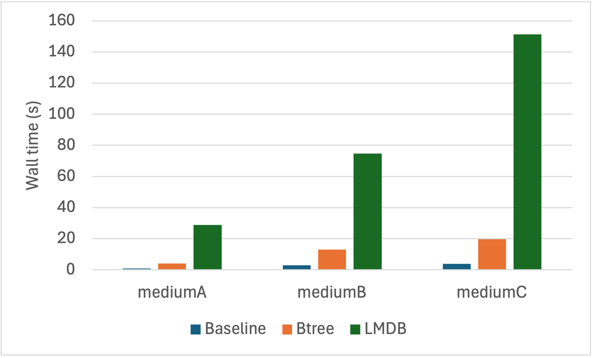
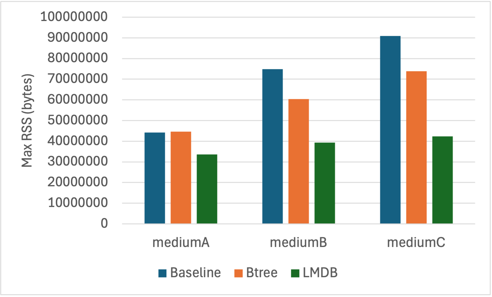

# BYODS Example

This folder contains some examples of how to use Ascent's BYODS functionality. `btreerel.rs` implements the necessary traits to switch out Ascent's default `HashMap` for a `BTree`. `lmdb.rs` adds support for an LMDB-based backend. `main.rs` shows how to use these different backends in a basic path-finding program.

Example: `cargo run data/smallA.facts lmdb`

## Preliminary Benchmarking Results

For testing, I used random graphs generated using the networkx `gnp_random_graph` function.
The small graphs have 100 nodes, the medium graphs have 500 nodes, and the large graphs have 2500 nodes.
I used three different settings for the probability of generating an edge: A = 0.1, B = 0.3, C = 0.5.
Reported results are the median value over 5 trials.

| File name | Num nodes | Num edges | Num paths |
|-----------|-----------|-----------|-----------|
| smallA    | 100       | 499       | 2790      |
| smallB    | 100       | 1532      | 4527      |
| smallC    | 100       | 2446      | 4767      |
| mediumA   | 500       | 12645     | 111498    |
| mediumB   | 500       | 37492     | 122375    |
| mediumC   | 500       | 62696     | 124027    |
| largeA    | 2500      | 312654    | 3057150   |
| largeB    | 2500      | 935821    | 3111420   |
| largeC    | 2500      | 1562258   | 3119881   |

The general summary of the results is that both the BTree and LMDB backends save RAM, but at an (unacceptable) cost to running time.
Here are figures for the performance on the medium* samples.

Baseline (Vanilla Ascent)
=============================

| File name          | Median wall time (secs) | Median max resident set size (bytes) |
|--------------------|-------------------------|--------------------------------------|
| smallA             | 0.007                   | 4849664                              |
| smallB             | 0.024                   | 6160384                              |
| smallC             | 0.033                   | 5931008                              |
| mediumA            | 0.941                   | 44236800                             |
| mediumB            | 2.795                   | 74874880                             |
| mediumC            | 3.929                   | 90996736                             |
| largeA             | 192.981                 | 1080344576                           |
| largeB             | 543.597                 | 1409974272                           |
| largeC             | 812.583                 | 1573257216                           |

BTree
=============================

| File name          | Median wall time (secs) | Median max resident set size (bytes) | Slowdown (x baseline) | Memory usage (% baseline) |
|--------------------|-------------------------|--------------------------------------|-----------------------|---------------------------|
| smallA             | 0.019                   | 4128768                              | 3x                    | 85%                       |
| smallB             | 0.073                   | 5406720                              | 3x                    | 88%                       |
| smallC             | 0.11                    | 5980160                              | 3x                    | 101%                      |
| mediumA            | 4.026                   | 44679168                             | 4x                    | 101%                      |
| mediumB            | 13.07                   | 60440576                             | 5x                    | 81%                       |
| mediumC            | 19.532                  | 73842688                             | 5x                    | 81%                       |
| largeA             | 839.553                 | 1009483776                           | 4x                    | 93%                       |
| largeB             | 2591.637                | 1213710336                           | 5x                    | 86%                       |
| largeC             | 3067.079                | 1498136576                           | 4x                    | 95%                       |

LMDB
=============================

| File name          | Median wall time (secs) | Median max resident set size (bytes) | Slowdown (x baseline) | Memory usage (% baseline) |
|--------------------|-------------------------|--------------------------------------|-----------------------|---------------------------|
| smallA             | 0.557                   | 6651904                              | 80x                   | 137%                      |
| smallB             | 1.207                   | 7569408                              | 50x                   | 123%                      |
| smallC             | 1.58                    | 8224768                              | 48x                   | 139%                      |
| mediumA            | 28.803                  | 33521664                             | 31x                   | 76%                       |
| mediumB            | 74.752                  | 39256064                             | 27x                   | 52%                       |
| mediumC            | 151.251                 | 42385408                             | 38x                   | 47%                       |
| largeA             | 3603.241                | 753549312                            | 19x                   | 70%                       |
| largeB             | -                       | -                                    | -                     | -                         |
| largeC             | -                       | -                                    | -                     | -                         |

I haven't yet generated results for largeB or largeC because the implementation is just so slow!!
It's unclear why the performance scales so poorly with increasing sample size. More profiling needed.