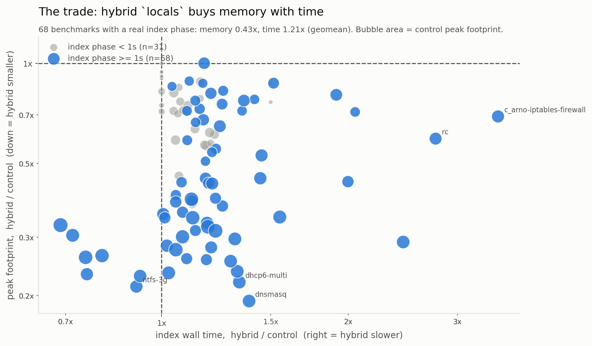
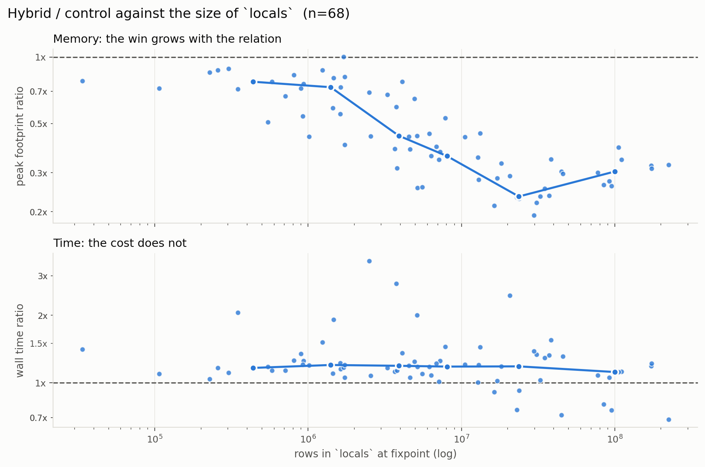
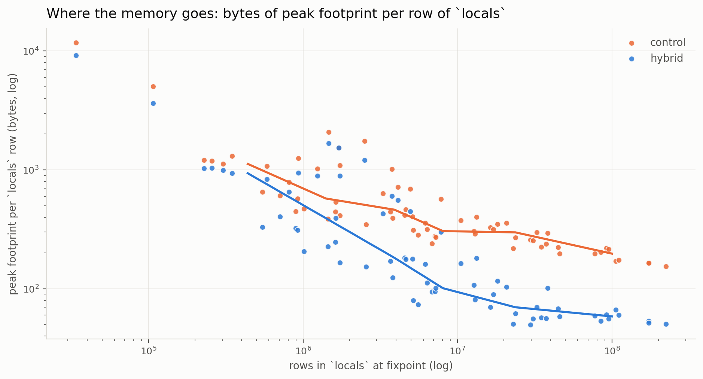
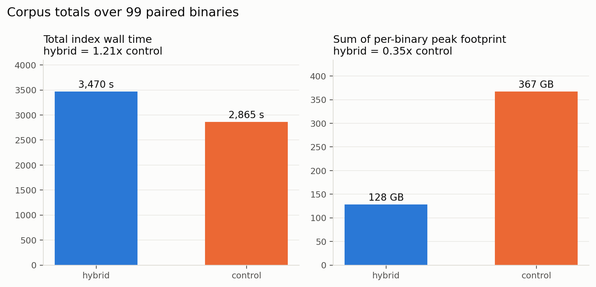
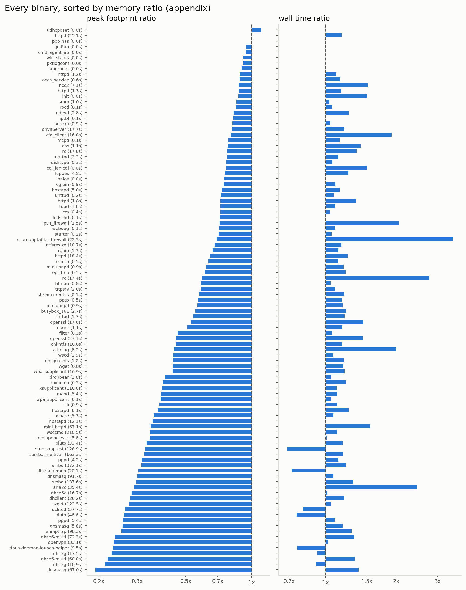

# Is the hybrid `locals` / `assign_like` data structure worth it?

**100 firmware binaries, two builds of the same commit, `ctadl index` only.**

The hybrid store landed in `de45c4b0` ("Implement hybrid locals data structure") to
answer a time/memory tradeoff for the `locals` relation, and the same `#[ds(...)]`
treatment was applied to `assign_like`. This measures what it actually bought.

* Commit under test: `291ece5b` (branch `head-to-head-hybrid-locals`), 2026-08-16.
* Machine: Apple M1 Ultra, 20 cores, 128 GB. macOS. Not otherwise idle — the box had
  a background load average of ~4-5 throughout; see *Threats to validity*.
* Ghidra 12.0.4 (`/nix/store/30m9yjgksz…-ghidra-12.0.4`), one lift per binary shared
  by both conditions.
* Harness, raw data and figures: `firmware-eval/run/hybrid-locals/`
  (`runs/results/<condition>/<label>.json` is the raw per-run record;
  `runs/raw.csv` is the flat table; `runs/TABLE.md` the per-binary table;
  `runs/figs/` the figures, light and dark, PNG + SVG).

---

## Verdict

**The hybrid structure is a memory optimization that costs time, and it is worth
keeping.** Over the 68 benchmarks where the Datalog phase does real work:

| | hybrid vs control |
|---|---|
| peak physical footprint | **0.43× (geomean), 0.40× median** — a 2.3× reduction |
| index wall time | **1.21× (geomean), 1.18× median** — a 21% tax |
| corpus totals (all 99 paired) | 128 GB vs 367 GB of summed peak; 3,470 s vs 2,865 s of wall |
| worst single peak | 10.5 GB vs **32.2 GB** |
| binaries whose index peaked over 16 GB | **0** vs **8** |
| index results | **identical on all 99 paired binaries**, relation by relation |

The memory win is not uniform — it *grows with the size of `locals`*, which is
exactly what the structure was built for. The time cost does not grow with it.

* `locals` under 1.7 M rows: memory 0.70×, time 1.25×
* `locals` 2.5 M – 13 M rows: memory 0.43×, time 1.31×
* `locals` over 13 M rows: memory **0.28×**, time **1.11×**

Correlation of log memory-ratio against log `locals` rows is **−0.78**. For wall
time it is −0.26 — i.e. essentially no relationship, and if anything the tax
*shrinks* on the biggest workloads.



---

## The two conditions

| | |
|---|---|
| **hybrid** (treatment) | `291ece5b` as committed: `#[ds(crate::index_engine::locals_trie)]` on `locals` and `#[ds(crate::index_engine::assign_like_trie)]` on `assign_like` |
| **control** | the same commit with those two attributes deleted, so both relations use Ascent's built-in storage |

Deleting the two attributes does not compile on its own: the code after the fixpoint
reaches into the trie's own API (`FromRows::from_rows`, `into_vec`, `heap_report`,
`num_reached_variables`). The control therefore carries four mechanical adaptations,
recorded exactly in `firmware-eval/run/hybrid-locals/control.patch`:

1. seed `prog.assign_like` directly instead of `FromRows::from_rows` — **deduplicated**,
   because `AssignTrie::from_rows` dedups on insert and an un-deduplicated seed would
   start the two conditions from different relations;
2. take the output rows from the physical relation rather than draining the trie;
3. drop the two trie heap-report debug lines;
4. report `reached_variables = 0` — the trie has an O(1) distinct-`(F,V)` count and the
   control does not; reconstructing it would mean a full `HashSet` pass over every
   `locals` row *after* the fixpoint, spending time and memory the control would not
   otherwise spend. It feeds one debug log line and nothing else.

Nothing else differs. Same binary, same models, same imported IR.

## Corpus

100 ELF firmware executables sampled from the 32,311 unique sink-bearing binaries of
the Operation Mango `large_dataset` corpus (1,684 firmware images), reusing that
campaign's per-binary cost profile to stratify. The mechanical rule is the docstring
of `select_corpus.py`; the picked set is `corpus.json`.

Strata are four bins on the previously measured `ctadl go` peak footprint —
300 MB–1.2 GB (15 binaries), 1.2–2 GB (25), 2–5 GB (30), 5 GB+ (30) — weighted toward
the heavy end. That weighting came out of a **15-binary calibration pilot**
(`pilot_corpus.json`, `pilot/`) which timed the index phase alone across the whole
cost range and found what the composite `go` number hides: on a small firmware
binary, `ctadl go` is almost entirely the Ghidra lift. Below roughly 1.2 GB of `go`
peak, the index phase finishes in 0.01–0.1 s and peaks at a few MB. The light
stratum is kept at reduced weight rather than dropped, because "most real firmware
binaries have a sub-second index phase where this choice cannot matter" is itself a
result: **31 of the 99 paired binaries had a control index phase under 1 second.**

## Method

Per binary: `ctadl import -l pcode` **once** into a pristine store (the Ghidra lift,
identical for both conditions and outside the measurement — 56 minutes of the
campaign in total), then each condition indexes a **fresh copy** of that store.
Only `ctadl index <name> --models cmdi-firmware.json5` is inside the timed region.

The two conditions for a binary run back to back, and their order alternates binary
by binary, so machine drift is common to both members of a pair and any residual
first/second-run effect does not land on one condition every time. Jobs run one at a
time — two 20 GB jobs sharing a machine would contend for exactly the resource being
measured. Guards: 1200 s wall, 48 GB physical footprint.

**Memory is macOS physical footprint, never RSS.** macOS compresses cold pages, so
`ps rss` badly undercounts; physical footprint is what Activity Monitor calls
"Memory". Peak comes from `/usr/bin/time -l`'s `peak memory footprint` line (the
kernel's own high-water mark) and wall from its `real` line; a 1 s `footprint -p`
poll runs alongside only to enforce the cap and to supply the numbers for a killed
job. (An early version of the harness took wall time from the polling loop, which
quantized every sub-second index to one poll interval. Fixed before any reported
measurement.)

Total campaign: 3.3 hours for 200 measured runs plus the imports.

## Results

### Whole corpus, all 99 paired binaries

| metric | geomean | median | q25 | q75 | min | max | hybrid wins |
|---|--:|--:|--:|--:|--:|--:|--:|
| index wall | 1.18× | 1.13× | 1.05× | 1.22× | 0.69× | 3.49× | 7/99 |
| peak footprint | 0.51× | 0.57× | 0.34× | 0.77× | 0.19× | 1.11× | 96/99 |

The 31 sub-second benchmarks pull both statistics toward 1.0 — at 0.01–0.5 s and a
few MB there is nothing for either structure to do. Restricted to the 68 with a
control index phase of at least 1 s:

| metric | geomean | median | q25 | q75 | hybrid wins |
|---|--:|--:|--:|--:|--:|
| index wall | 1.21× | 1.18× | 1.08× | 1.31× | 7/68 |
| peak footprint | 0.43× | 0.40× | 0.30× | 0.69× | 67/68 |

Across those 68, the hybrid build gave up **604 seconds** and saved **238 GB** of
summed peak footprint.

### By stratum

| `go` peak stratum | n | median control index | memory (geomean) | time (geomean) |
|---|--:|--:|--:|--:|
| 300 MB – 1.2 GB | 15 | 0.0 s | 0.79× | 1.11× |
| 1.2 – 2 GB | 25 | 0.9 s | 0.62× | 1.11× |
| 2 – 5 GB | 30 | 6.0 s | 0.41× | 1.14× |
| 5 GB+ | 29 | 23.1 s | 0.43× | 1.32× |

### By size of `locals` — the relation actually under test

`locals` is never persisted, so its row count came from a separate **unmeasured**
pass (`stats_pass.py`) that re-indexed each substantive benchmark once with
`RUST_LOG=…index_engine=debug`. The count is a property of the benchmark, not of the
condition — the equivalence check below proves the two builds compute the same
relation — so one build suffices and nothing here touches the timing numbers.

| `locals` rows | n | memory (geomean) | time (geomean) |
|---|--:|--:|--:|
| 34 K – 1.7 M | 22 | 0.70× | 1.25× |
| 2.5 M – 13 M | 22 | 0.43× | 1.31× |
| 13 M – 224 M | 24 | **0.28×** | **1.11×** |



### The mechanism

Peak footprint divided by `locals` rows is the per-row cost of the whole index run.
It separates cleanly:

| `locals` size | control | hybrid |
|---|--:|--:|
| under 1 M rows (n=13) | 1,123 B/row | 937 B/row |
| over 20 M rows (n=20) | **219 B/row** | **58 B/row** |

At small sizes both are dominated by everything that is not `locals` and the
structures are indistinguishable. As `locals` comes to dominate the footprint, the
built-in storage settles at roughly 219 bytes per row while the hybrid store settles
near 58 — about a **3.8× lower marginal cost per row**, which is precisely the
compact-linear-probe-then-swiss-table design doing its job.



### Corpus totals



### The one outcome difference

| binary | hybrid | control |
|---|---|---|
| `ntfs-3g_6a3bed1b` | **timeout** — killed at 1200 s, having reached 25.9 GB | **OOM** — killed at 525 s on the 48 GB cap |

Neither finished. The honest reading is narrow: on this binary the hybrid build was
still climbing at half the control's footprint when the wall clock ran out, and the
control was already through 48 GB. It is a memory-limit datapoint, not a "hybrid
rescues an OOM" datapoint, and there is exactly one of it.

### Where the hybrid loses time

The tax is usually modest, but the tail is real. Worst regressions:

| binary | hybrid wall | control wall | ratio | memory ratio |
|---|--:|--:|--:|--:|
| `c_arno-iptables-firewall` | 77.9 s | 22.3 s | **3.49×** | 0.69× |
| `rc` | 48.2 s | 17.4 s | 2.77× | 0.59× |
| `aria2c` | 86.8 s | 35.4 s | 2.45× | 0.29× |
| `ipv4_firewall` | 3.1 s | 1.5 s | 2.05× | 0.71× |
| `athdiag` | 16.4 s | 8.2 s | 2.00× | 0.44× |

And where it wins on both axes at once — note these are among the heaviest runs in
the corpus:

| binary | hybrid | control | time | memory |
|---|--:|--:|--:|--:|
| `stressapptest` | 87.1 s / 10.5 GB | 126.9 s / 32.2 GB | 0.69× | 0.33× |
| `dbus-daemon` | 14.4 s / 2.8 GB | 20.1 s / 9.3 GB | 0.72× | 0.30× |
| `pluto` | 36.8 s / 5.0 GB | 48.8 s / 19.1 GB | 0.75× | 0.26× |
| `uclited` | 46.2 s / 4.2 GB | 57.7 s / 16.0 GB | 0.80× | 0.26× |

Seven of the 99 ran faster under the hybrid store. The plausible reading is that
once the control's working set stops fitting comfortably, it starts paying for its
own footprint — but this experiment did not isolate that, so treat it as a
hypothesis, not a finding.



## Correctness

A storage change must not change results. After each measured run the harness
fingerprints the index that run produced — row count per relation from parquet
metadata, plus an order-independent sha256 over the sorted rows for relations under
a 3 M-row cap — and `analyze.py` compares the two conditions relation by relation.

**All 99 paired binaries: identical.** Every relation, every row count, every
content hash that was computed. Separately spot-checked at debug level on
`init.sysvinit`: `locals` 2,433,847 rows, `assign_like` 202,428, `summary` 25,357 —
the same under both builds. (The files on disk are *not* byte-identical, because the
two stores serialize the same relation in different physical orders; that is why the
comparison sorts.)

## Threats to validity

* **The machine was not idle.** Background load averaged ~4-5 for the whole campaign.
  The pairing design (two conditions back to back, order alternating) makes this
  mostly common-mode, but individual ratios carry more noise than a quiet machine
  would give. The sub-second benchmarks are noise-dominated outright, which is why
  they are reported separately rather than folded in.
* **Single run per cell.** No repetitions, so per-binary ratios have no error bars.
  The aggregate conclusions rest on 99 binaries spanning four orders of magnitude of
  workload, not on any single measurement.
* **The corpus is stratified, not uniform.** It deliberately over-weights heavy
  binaries relative to the firmware population, because that is where the question
  lives. Do not read the corpus totals as "what a firmware-wide run costs" — read
  the per-stratum and per-`locals`-size tables.
* **`peak footprint` is process-wide**, so it includes everything the index does, not
  just the two relations. That is the right number for "will this run on my machine",
  and it is why the per-row figure only separates cleanly once `locals` dominates.
* **The timeout/OOM guards are policy, not physics.** `ntfs-3g_6a3bed1b` under
  different guards might have resolved either way.
* **`ascent_par!` was not measured.** Only the serial `ascent!` path (and thus
  `locals_trie` / `assign_like_trie`, not `c_locals_trie` / `c_assign_like_trie`)
  is exercised here.

## Recommendation

**Keep it, as the default.** A 2.3× reduction in peak footprint on real workloads —
3.6× on the heaviest third — for a ~20% wall-time tax is a good trade for an analysis
whose practical failure mode is exhausting memory, not running long: eight binaries
in this corpus peaked over 16 GB under the built-in storage and none did under the
hybrid store.

Two things worth following up, in order:

1. **The time tail.** `c_arno-iptables-firewall` at 3.49× and `rc` at 2.77× are not
   explained by workload size — both are mid-sized, and both give back less memory
   than average. Something about their access pattern is hitting the hybrid store
   badly. That is a profile away, and it is where the remaining time cost lives.
2. **Making it a knob.** Nothing here argues for the structure on a binary whose
   index phase is 0.05 s and 5 MB — a third of this corpus. The default should be the
   hybrid store, but a flag that selects the built-in storage would cost little and
   would make the tail case above easy to work around in the field.

## Reproducing

Everything is in `firmware-eval/run/hybrid-locals/` — see its `README.md`. Short
version:

```sh
cargo build --release --bin ctadl
cp target/release/ctadl firmware-eval/run/hybrid-locals/bin/ctadl-hybrid
git apply firmware-eval/run/hybrid-locals/control.patch
cargo build --release --bin ctadl
cp target/release/ctadl firmware-eval/run/hybrid-locals/bin/ctadl-control
git checkout ctadl-ascent/src/index_engine/mod.rs

cd firmware-eval/run/hybrid-locals
python3 select_corpus.py                              # regenerate corpus.json
JOB_TIMEOUT=1200 JOB_MEMCAP_GB=48 python3 campaign.py # ~3.3 h
python3 stats_pass.py                                 # workload sizes (unmeasured)
python3 analyze.py                                    # aggregate.json, TABLE.md, raw.csv
python3 plot.py                                       # runs/figs/
```
